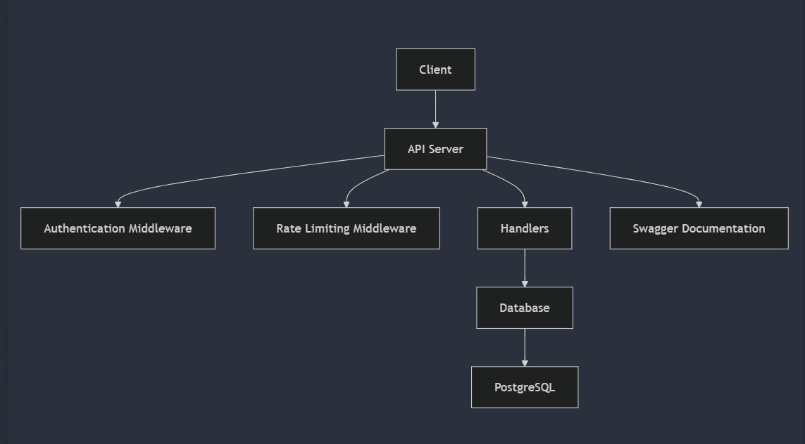
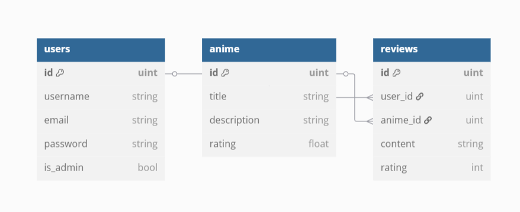
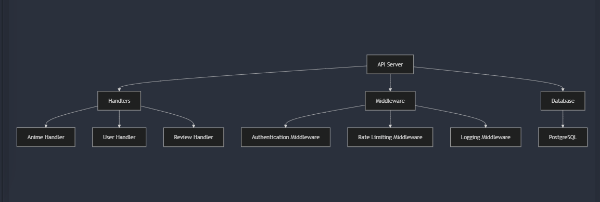
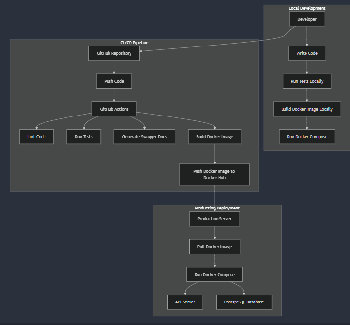
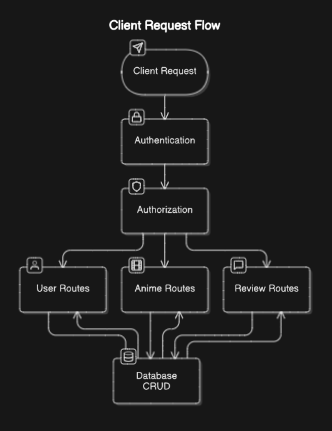
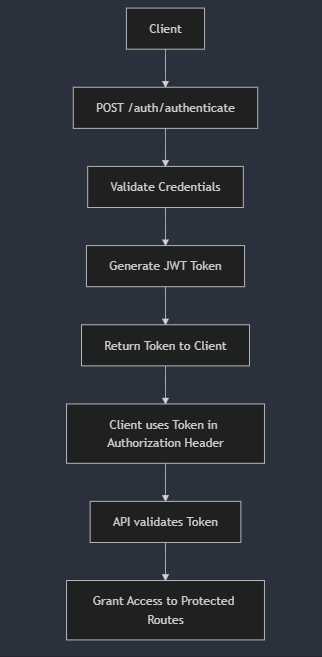
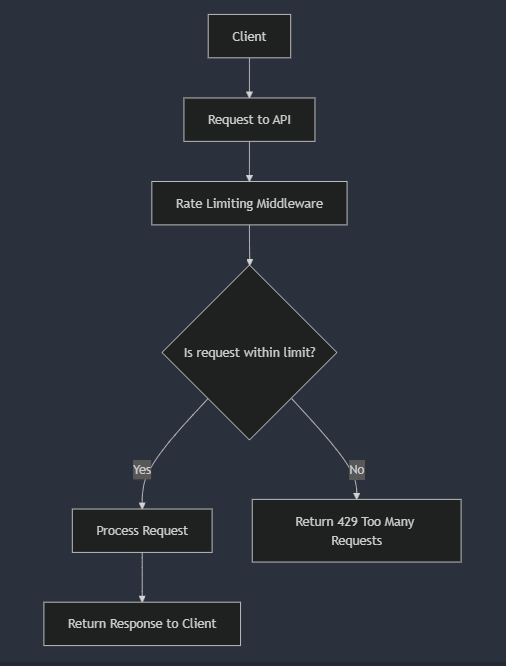
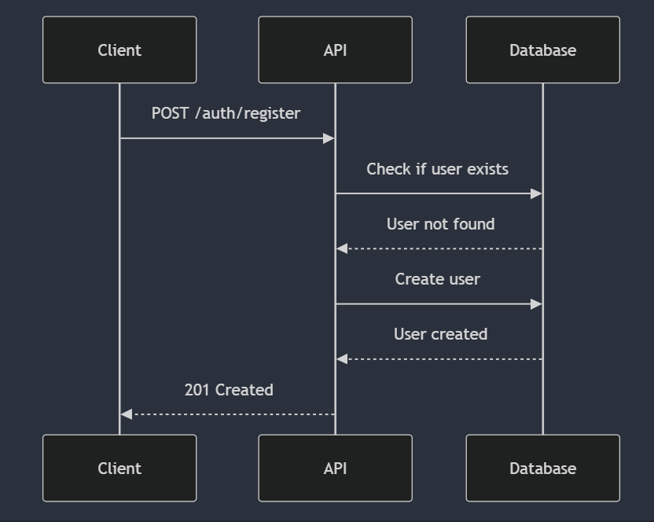
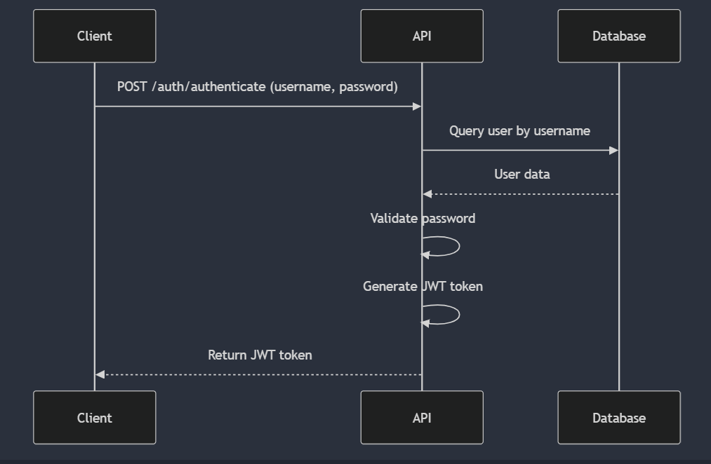
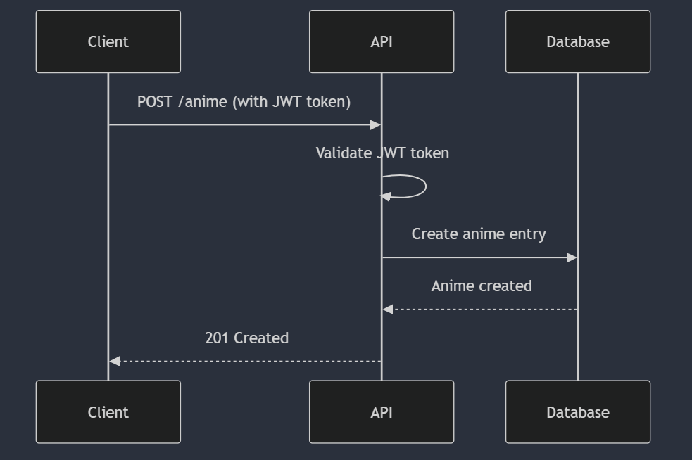

# MyAnimeAPI

MyAnimeAPI is a full-stack anime management platform exposing a **REST API**, a **GraphQL API**, and a **React SPA** frontend — all containerised and ready to run with a single `docker compose up`. The backend is built in Go with a hexagonal architecture (Gorilla Mux · gqlgen · GORM · PostgreSQL · Redis). The frontend is a Vite + React 18 + TypeScript + Tailwind SPA with JWT auth, TanStack Query, and full favorites/profile pages.

---

## 🚀 Service Entry Points

> Run `docker compose up --build` then open any URL below in your browser.

| Service | Local URL | Docker URL | Description |
|---------|-----------|------------|-------------|
| **Frontend** | `http://localhost:5173` (dev) | `http://localhost:5173` | Vite + React SPA (nginx in Docker) |
| **REST API** | `http://localhost:8080/v1` | `http://localhost:8080/v1` | Go REST API |
| **Swagger UI** | `http://localhost:8080/swagger/index.html` | `http://localhost:8080/swagger/index.html` | Interactive REST docs |
| **GraphQL API** | `http://localhost:8080/v1/graphql` | `http://localhost:8080/v1/graphql` | GraphQL endpoint (POST) |
| **GraphQL Playground** | `http://localhost:8080/v1/graphql/playground` | `http://localhost:8080/v1/graphql/playground` | Interactive GraphQL explorer |
| **Prometheus** | — | `http://localhost:9090` | Metrics scraper UI |
| **Grafana** | — | `http://localhost:3000` | Dashboards (admin / admin) |
| **Locust** | — | `http://localhost:8089` | Load test UI (`--profile load-test`) |
| **Health check** | `http://localhost:8080/v1/health` | `http://localhost:8080/v1/health` | API liveness probe |
| **Metrics endpoint** | `http://localhost:8080/metrics` | `http://localhost:8080/metrics` | Prometheus scrape target |

---

## Table of Contents

- [MyAnimeAPI](#myanimeapi)
  - [🚀 Service Entry Points](#-service-entry-points)
  - [Table of Contents](#table-of-contents)
  - [Features](#features)
  - [Technologies Used](#technologies-used)
  - [Getting Started](#getting-started)
    - [Prerequisites](#prerequisites)
    - [Installation](#installation)
    - [Docker Setup](#docker-setup)
  - [Project Structure](#project-structure)
  - [API Endpoints](#api-endpoints)
    - [Health Check](#health-check)
    - [Version](#version)
    - [Authentication](#authentication)
    - [Users](#users)
    - [Anime](#anime)
    - [Genres](#genres)
    - [Tags](#tags)
    - [Reviews](#reviews)
  - [Documentation](#documentation)
    - [Swagger Documentation](#swagger-documentation)
    - [GoDoc Documentation](#godoc-documentation)
  - [Testing](#testing)
    - [Unit Tests](#unit-tests)
    - [Integration Tests](#integration-tests)
    - [End-to-End Tests](#end-to-end-tests)
    - [Smoke Tests](#smoke-tests)
    - [Test Coverage](#test-coverage)
- [TODO: Need to be updated the images/diagrams](#todo-need-to-be-updated-the-imagesdiagrams)
  - [Diagrams](#diagrams)
    - [**1. Architecture Diagram**](#1-architecture-diagram)
    - [**2. Database Schema (ER Diagram)**](#2-database-schema-er-diagram)
    - [**3. Component Diagram**](#3-component-diagram)
    - [**4. Deployment Diagram**](#4-deployment-diagram)
    - [**5. Client Request Flow**](#5-client-request-flow)
    - [**6. Authentication Flow**](#6-authentication-flow)
    - [**7. Rate Limiting Flow**](#7-rate-limiting-flow)
    - [**8. User Registration Sequence**](#8-user-registration-sequence)
    - [**9. User Authentication Sequence**](#9-user-authentication-sequence)
    - [**10. Anime Creation Sequence**](#10-anime-creation-sequence)
    - [**How to Generate Diagrams**](#how-to-generate-diagrams)
    - [**Notes**](#notes)
  - [Contributing](#contributing)
  - [Changelog](#changelog)
  - [Badges](#badges)
  - [License](#license)
  - [Acknowledgments](#acknowledgments)
  - [Contact](#contact)

---

## Features

### Backend
- **Anime Management** — CRUD with genres, tags, and advanced search (multi-genre AND, episode range, year range)
- **User Management** — register, authenticate, manage profiles with JWT
- **Review Management** — CRUD with media attachments
- **Favorites** — add/remove anime favorites per user
- **GraphQL API** — parallel REST interface with the same business logic
- **Gzip Compression** — automatic response compression via middleware
- **Prometheus Metrics** — `/metrics` scrape endpoint with per-route histograms
- **Rate Limiting** — per-IP request throttling with Redis
- **Swagger Docs** — auto-generated at `/swagger/index.html`
- **Advanced Search** — filter by genre/tag AND-semantics, episode count range, year range
- **Hexagonal Architecture** — business logic decoupled from REST/GraphQL adapters
- **Health Monitoring** — `/v1/health` reports DB, cache, and storage status

### Frontend (React SPA)
- **Catalog** — paginated anime list with debounced full-text search
- **Anime Detail** — synopsis, rating, genres/tags badges, reviews list
- **Favorites** — authenticated users can save/remove anime; hover-reveal remove button
- **Profile** — displays avatar (initials fallback), email, bio, member since, sign-out
- **Auth** — JWT stored in localStorage; axios interceptor adds `Authorization` header automatically
- **Protected Routes** — `/favorites` and `/profile` redirect to login when unauthenticated
- **Observability stack** — Grafana dashboards + Prometheus alerts wired out of the box

## Technologies Used

### Backend
- **Go 1.25** — backend language
- **Gorilla Mux** — HTTP router
- **gqlgen** — code-first GraphQL server
- **GORM** — ORM for PostgreSQL (production) and SQLite (tests)
- **PostgreSQL 15** — relational database
- **Redis 7** — rate-limit counters and response cache
- **golang-migrate** — embedded SQL schema migrations
- **JWT** (`golang-jwt`) — stateless authentication
- **Swagger / swaggo** — auto-generated REST docs at `/swagger/index.html`
- **Prometheus client** — `/metrics` scrape endpoint + middleware histograms
- **Gzip middleware** — transparent response compression via `sync.Pool`

### Frontend
- **React 18** + **TypeScript** — component model
- **Vite 5** — bundler / dev server with HMR
- **Tailwind CSS 3** — utility-first styling
- **React Router v6** — client-side routing with protected routes
- **TanStack Query v5** — server state, caching, mutations
- **Axios** — HTTP client with JWT interceptor
- **React Hook Form** + **Zod** — form management and schema validation

### Observability & Infrastructure
- **Prometheus** + **Grafana** — metrics collection and dashboards
- **nginx 1.27** — static-file server + API reverse proxy for the production frontend container
- **Docker Compose** — multi-service local stack
- **GitHub Actions** — CI pipeline (lint · test · build · push to GHCR · deploy)
- **GolangCI-Lint** — Go code quality
- **SonarCloud** — code quality and security analysis

## Getting Started

### Prerequisites

- **Go 1.25+** (backend)
- **Node.js 20+** + npm (frontend dev only — not needed for Docker)
- **Docker Desktop** (recommended — runs the full stack in one command)
- PostgreSQL 15 (or use the Docker Compose service)
- AWS Account (for S3 media storage, optional)

### Installation

Clone the repository:

```bash
git clone https://github.com/italo-gouveia/myanimeapi.git
cd myanimeapi
```

Set up the database:

- Ensure PostgreSQL is running
- Create a database named `myanimeapi`
- Update the `.env` file with your PostgreSQL credentials
- For features like "Forgot Password", ensure you also configure email-related environment variables in the `.env` file (e.g., `EMAIL_FROM`, `EMAIL_PASSWORD`, `SMTP_HOST`, `SMTP_PORT`, `FRONTEND_URL`).

Run the application:

```bash
go run cmd/main.go
```

The API will be available at `http://localhost:8080/v1`.

### Docker Setup

Copy the sample env file and fill in your secrets:

```bash
cp .env.example .env   # edit DB_USER, DB_PASSWORD, JWT_SECRET, etc.
```

#### Full stack (API + Frontend + Postgres + Redis + Prometheus + Grafana)

```bash
docker compose up --build
```

| Container | Port | Notes |
|-----------|------|-------|
| `myanimeapi-frontend` | `5173 → 80` | React SPA served by nginx, proxies `/v1` → API |
| `myanimeapi-api` | `8080` | Go REST + GraphQL backend |
| `myanimeapi-db` | `5432` | PostgreSQL 15 |
| `myanimeapi-redis` | `6379` | Redis 7 cache |
| `myanimeapi-prometheus` | `9090` | Prometheus metrics |
| `myanimeapi-grafana` | `3000` | Grafana dashboards (admin / admin) |

#### Load-test profile (adds Locust)

```bash
docker compose --profile load-test up --build
```

#### Development (Go hot-reload with Air + node vite dev server)

```bash
# Terminal 1 — backend
docker compose -f docker-compose.dev.yml up

# Terminal 2 — frontend (with HMR)
cd frontend && npm install && npm run dev
```

#### Run API image standalone

```bash
docker build -t myanimeapi-api:local -f Dockerfile .
docker build -t myanimeapi-frontend:local -f Dockerfile.frontend .
```

> The Dockerfile now uses **Go 1.25** to match `go.mod`.  
> The frontend image is a two-stage build: Node 20 compiles the Vite app; nginx 1.27 serves the static bundle and reverse-proxies `/v1/*` to the API container.

## Project Structure

The project follows a **hexagonal architecture** (Ports & Adapters), where business logic in `api/services/` and `api/repositories/` is completely decoupled from the protocol adapters (`http`, `graphql`). Adding a new adapter (gRPC, WebSocket, etc.) only requires creating a new directory under `api/adapters/`.

```
myanimeapi/
├── api/
│   ├── adapters/
│   │   ├── http/           # REST input adapter
│   │   │   ├── anime_handlers.go
│   │   │   ├── auth_handler.go
│   │   │   ├── favorite_handler.go
│   │   │   ├── genre_handler.go
│   │   │   ├── review_handlers.go
│   │   │   ├── tag_handler.go
│   │   │   └── user_handler.go
│   │   └── graphql/        # GraphQL input adapter
│   │       ├── schema/schema.graphql
│   │       ├── generated/generated.go
│   │       ├── model/models_gen.go
│   │       ├── resolver.go
│   │       └── schema.resolvers.go
│   ├── models/             # Shared domain models and DTOs
│   ├── services/           # Application layer / use cases
│   ├── repositories/       # Data access interfaces + implementations
│   ├── middleware/         # Auth · gzip · metrics · rate-limit middleware
│   ├── auth/               # JWT helpers and password hashing
│   ├── mocks/              # Generated mocks for testing
│   └── routes/             # Composition root
├── cmd/
│   ├── main.go             # Application entry point
│   └── docs/               # Generated Swagger docs (swag init)
├── internal/
│   ├── config/             # Configuration loading (.env)
│   ├── database/           # golang-migrate runner + embedded SQL migrations
│   ├── db/                 # GORM abstraction interface
│   ├── errors/             # Custom error types
│   └── logger/             # Structured logging (logrus)
├── tests/
│   ├── e2e/                # End-to-end tests (real DB)
│   ├── integration/        # Integration tests
│   ├── smoke/              # Smoke tests (running server required)
│   └── fixtures/           # Test data factories
├── frontend/               # React 18 + Vite + TypeScript SPA
│   ├── src/
│   │   ├── components/     # Button, Input, AnimeCard, Layout, Navbar
│   │   ├── pages/          # HomePage, AnimeDetailPage, FavoritesPage, ProfilePage
│   │   │                   # LoginPage, RegisterPage, NotFoundPage
│   │   ├── routes/         # AppRoutes, ProtectedRoute
│   │   └── lib/
│   │       ├── api/        # axios client, types, animes/favorites/users API helpers
│   │       └── auth/       # AuthProvider (JWT localStorage context)
│   ├── nginx.conf          # nginx site config for production container
│   ├── vite.config.ts      # Vite config (dev proxy → localhost:8080)
│   └── package.json
├── prometheus/
│   ├── prometheus.yml      # Scrape config (api:8080/metrics)
│   └── alerts.yml          # Alerting rules
├── grafana/provisioning/   # Auto-provisioned datasource + dashboards
├── scripts/hooks/pre-push  # Git hook (lint + tests)
├── Dockerfile              # Multi-stage Go 1.25 → alpine API image
├── Dockerfile.frontend     # Multi-stage Node 20 → nginx 1.27 SPA image
├── docker-compose.yml      # Full dev stack (API + Frontend + DB + Redis + observability)
├── docker-compose.dev.yml  # Hot-reload dev stack (source volume mount)
├── docker-compose.prod.yml # Production stack (pull GHCR image)
├── docker-compose.test.yml # Test stack (PostgreSQL :5433 + Redis + MinIO)
├── gqlgen.yml              # gqlgen code generation config
└── assets/                 # Architecture diagrams
```

## API Endpoints

### Health Check

- **GET** `/v1/health`: Check the health of the API and its dependencies

**Response:**
```json
{
  "status": "success",
  "message": "Service is healthy",
  "data": {
    "database": "OK",
    "cache": "OK",
    "storage": "OK"
  }
}
```

### Version

- **GET** `/v1/version`: Get the current API version

**Response:**
```json
{
  "version": "1.7.0",
  "build_time": "2025-05-12T10:00:00Z",
  "git_commit": "a9e16fe"
}
```

### Authentication

- **POST** `/v1/auth/register`: Register a new user
- **POST** `/v1/auth/login`: Authenticate a user and receive a JWT token
- **POST** `/v1/auth/refresh`: Refresh an expired JWT token
- **POST** `/v1/auth/logout`: Invalidate the current JWT token

### Users

| Method | Endpoint | Description | Authentication Required |
|--------|----------|-------------|------------------------|
| POST | `/v1/users/register` | Register a new user | No |
| POST | `/v1/users/login` | Authenticate a user | No |
| GET | `/v1/users/profile` | Get user profile | Yes |
| PUT | `/v1/users/profile` | Update user profile | Yes |
| POST | `/v1/users/forgot-password` | Request password reset | No |
| POST | `/v1/users/reset-password` | Reset password with token | No |
| POST | `/v1/users/change-password` | Change password | Yes |
| POST | `/v1/users/deactivate` | Deactivate account | Yes |
| GET | `/v1/users/{id}/reviews` | Get user's reviews | No |
| GET | `/v1/users/{id}/favorites` | Get user's favorites | No |

### Anime

| Method | Endpoint | Description | Authentication Required |
|--------|----------|-------------|------------------------|
| GET | `/v1/anime` | Get all anime with pagination | No |
| GET | `/v1/anime/{id}` | Get anime by ID | No |
| POST | `/v1/anime` | Create anime | Yes |
| PUT | `/v1/anime/{id}` | Update anime | Yes |
| DELETE | `/v1/anime/{id}` | Delete anime | Yes |
| GET | `/v1/anime/search` | Search anime | No |
| GET | `/v1/anime/{id}/reviews` | Get anime reviews | No |
| POST | `/v1/anime/{id}/favorite` | Add to favorites | Yes |
| DELETE | `/v1/anime/{id}/favorite` | Remove from favorites | Yes |
| GET | `/v1/anime/favorites` | Get user's favorites | Yes |

### Genres

| Method | Endpoint | Description | Authentication Required |
|--------|----------|-------------|------------------------|
| GET | `/v1/genres` | Get all genres | No |
| GET | `/v1/genres/{id}` | Get genre by ID | No |
| POST | `/v1/genres` | Create genre | Yes |
| PUT | `/v1/genres/{id}` | Update genre | Yes |
| DELETE | `/v1/genres/{id}` | Delete genre | Yes |
| GET | `/v1/genres/search` | Search genres | No |
| POST | `/v1/genres/bulk` | Bulk create genres | Yes |
| DELETE | `/v1/genres/bulk` | Bulk delete genres | Yes |
| GET | `/v1/genres/{id}/anime` | Get anime by genre | No |

### Tags

| Method | Endpoint | Description | Authentication Required |
|--------|----------|-------------|------------------------|
| GET | `/v1/tags` | Get all tags | No |
| GET | `/v1/tags/{id}` | Get tag by ID | No |
| POST | `/v1/tags` | Create tag | Yes |
| PUT | `/v1/tags/{id}` | Update tag | Yes |
| DELETE | `/v1/tags/{id}` | Delete tag | Yes |
| GET | `/v1/tags/search` | Search tags | No |
| POST | `/v1/tags/bulk` | Bulk create tags | Yes |
| DELETE | `/v1/tags/bulk` | Bulk delete tags | Yes |
| GET | `/v1/tags/{id}/anime` | Get anime by tag | No |

### Reviews

| Method | Endpoint | Description | Authentication Required |
|--------|----------|-------------|------------------------|
| GET | `/v1/reviews` | Get all reviews with pagination | No |
| GET | `/v1/reviews/{id}` | Get review by ID | No |
| POST | `/v1/reviews` | Create review | Yes |
| PUT | `/v1/reviews/{id}` | Update review | Yes |
| DELETE | `/v1/reviews/{id}` | Delete review | Yes |
| GET | `/v1/reviews/user/{id}` | Get user's reviews | No |
| GET | `/v1/reviews/anime/{id}` | Get anime's reviews | No |

### GraphQL

The GraphQL endpoint runs alongside REST and exposes the same business logic through a typed schema.

| Endpoint | Method | Description |
|----------|--------|-------------|
| `/v1/graphql` | POST | GraphQL query / mutation endpoint |
| `/v1/graphql/playground` | GET | Interactive GraphQL Playground (dev) |

**Available Queries:**

```graphql
query {
  anime(id: "1") { id title rating genres { name } }
  animes(page: 1, limit: 20) { total data { id title } }
  animesByTitle(title: "Naruto", page: 1, limit: 10) { total data { id title } }
  genre(id: "1") { id name }
  genres(page: 1, limit: 50) { id name }
}
```

**Available Mutations:**

```graphql
mutation {
  login(username: "user", password: "pass") { token }
  register(username: "new", email: "new@example.com", password: "pass") { id username }
  createAnime(title: "Attack on Titan", episodes: 75, status: "Completed") { id title }
  deleteAnime(id: "1")
}
```

Schema source: [`api/adapters/graphql/schema/schema.graphql`](api/adapters/graphql/schema/schema.graphql)  
Code generation config: [`gqlgen.yml`](gqlgen.yml)

## Documentation

### Swagger Documentation

Generate Swagger documentation:

```bash
swag init -g cmd/main.go --dir ./cmd,./api/adapters/http,./api/models,./internal/errors -o ./cmd/docs
```

Or simply:

```bash
make swagger
```

The REST documentation is available at `/swagger/index.html` when running the server. It provides detailed information about:

- Available endpoints
- Request/response schemas
- Authentication requirements
- Example requests and responses
- Error codes and their meanings

### GoDoc Documentation

Start the godoc server:

```bash
godoc -http=:6060
```

Access the documentation at `http://localhost:6060/pkg/myanimeapi/`
The GoDoc documentation is available at [pkg.go.dev](https://pkg.go.dev/github.com/italo-gouveia/myanimeapi).

## Testing

Unit tests live **co-located** with the source they test (`api/adapters/http/*_test.go`, etc.) following Go convention. Integration, E2E, and smoke tests live under `tests/`.

### Unit Tests (co-located)

```bash
# All packages (includes co-located unit tests)
go test ./api/... -v

# Specific adapter
go test ./api/adapters/http/... -v
```

### Integration Tests

```bash
go test ./tests/integration/... -v
```

### End-to-End Tests (requires PostgreSQL)

```bash
# Start test DB first, then run
make test-db
```

### Smoke Tests (requires running server)

```bash
go test ./tests/smoke/... -v
```

### All Tests with DB

```bash
# Starts postgres:5433 via Docker, runs all tests, stops container
make test-db
```

### Test Coverage

```bash
go test ./... -coverprofile=coverage.out
go tool cover -html=coverage.out
```

## Diagrams

Visual representations of the architecture, database schema, and key workflows. Images are stored in `./assets/`. Diagrams reflect the **pre-hexagonal** state and will be updated in a future iteration.

---

### **1. Architecture Diagram**
The high-level architecture of the MyAnimeAPI application, showing the interaction between components.



---

### **2. Database Schema (ER Diagram)**
The Entity-Relationship (ER) diagram for the database, illustrating the relationships between `users`, `anime`, and `reviews` tables.



---

### **3. Component Diagram**
A breakdown of the application's components, including handlers, middleware, and database interactions.



---

### **4. Deployment Diagram**
The deployment flow, showing how the application is built, tested, and deployed using Docker and GitHub Actions.



---

### **5. Client Request Flow**
The flow of a typical client request through the API, including middleware and handlers.



---

### **6. Authentication Flow**
The JWT-based authentication flow, detailing how users authenticate and access protected routes.



---

### **7. Rate Limiting Flow**
The rate-limiting mechanism, showing how requests are throttled to prevent abuse.



---

### **8. User Registration Sequence**
The sequence of steps involved in registering a new user.



---

### **9. User Authentication Sequence**
The sequence of steps involved in authenticate an user.



---

### **10. Anime Creation Sequence**
The sequence of steps involved in creating a new anime entry.



---

### **How to Generate Diagrams**
1. Use tools like [Mermaid Live Editor](https://mermaid-js.github.io/mermaid-live-editor/) or [dbdiagram.io](https://dbdiagram.io/) to create the diagrams.
2. Export the diagrams as `.png` or `.svg` files.
3. Save the images in the `./assets/` directory.
4. Reference the images in the `README.md` as shown above.

---

### **Notes**
- Ensure all diagram images are stored in the `./assets/` directory.
- Use consistent naming conventions for the diagram files (e.g., `architecture_diagram.png`, `entity_model_relationship.png`).
- If you update the diagrams, make sure to update the corresponding images in the `resources` folder.


## Contributing

1. Fork the repository
2. Create your feature branch (`git checkout -b feature/amazing-feature`)
3. Commit your changes (`git commit -m 'Add some amazing feature'`)
4. Push to the branch (`git push origin feature/amazing-feature`)
5. Open a Pull Request

## Changelog

See [CHANGELOG.md](CHANGELOG.md) for a list of changes.

## Badges

[](https://goreportcard.com/report/github.com/italo-gouveia/myanimeapi)
[](https://godoc.org/github.com/italo-gouveia/myanimeapi)
[](https://opensource.org/licenses/MIT)
[](https://github.com/italo-gouveia/myanimeapi/actions)
[](https://sonarcloud.io/dashboard?id=italo-gouveia_myanimeapi)
[](https://sonarcloud.io/dashboard?id=italo-gouveia_myanimeapi)

## License

This project is licensed under the MIT License - see the [LICENSE](LICENSE) file for details.

## Acknowledgments

- [Gorilla Mux](https://github.com/gorilla/mux)
- [GORM](https://gorm.io/)
- [Swagger](https://swagger.io/)
- [JWT-Go](https://github.com/golang-jwt/jwt)
- [Validator](https://github.com/go-playground/validator)
- [Bluemonday](https://github.com/microcosm-cc/bluemonday)

## Contact
For questions or feedback, please reach out to italogouveiadev@outlook.com.


Project Link: [https://github.com/italo-gouveia/myanimeapi](https://github.com/italo-gouveia/myanimeapi)